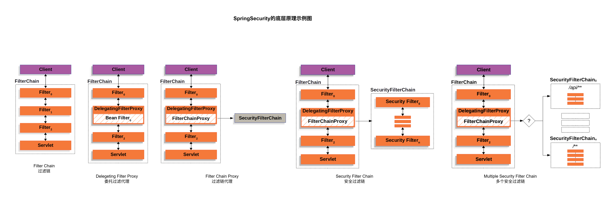

# 权限管理

## 权限管理概述

### 为什么需要权限管理

- **安全性**：误操作、人为破坏、数据泄露等。
- **数据隔离**：不同的权限能看到及操作不同的数据。
- **明确职责**：运营、客服等不同角色，leader 和 dev 等不同级别。

### 权限管理核心

- **用户-权限**：人员少，功能固定，或者特别简单的系统。
- **RBAC(Role-Based-Access-Control)**：基于角色的权限访问控制。

### 理想中的权限管理

- 能实现角色级权限：RBAC。
- 实现功能级、数据级权限。
- 简单、易操作，能够应对各种需求。

### 相关操作界面

- 权限管理界面、角色管理界面、用户管理界面。
- 角色和权限关系维护界面，用户和角色关系维护界面。

### 开源权限项目

- Spring Security
- Apache Shiro

### 开发使用

- Spring Security
- Apache Shiro
- 从 0 开始开发 RBAC 权限管理系统。

### 技术栈

- Spring、MySQL、Redis、Java、jQuery

# Spring Security

## Spring Security 介绍

- 官网地址：https://docs.spring.io/spring-security/reference/index.html
- Spring Security 专注于为 Java 应用提供 **身份认证** 和 **授权控制**。它广泛用于 Web 应用、微服务、REST API 的安全保护。

## 功能
- **身份认证**：认证是谁在访问系统资源，判断是否为合法用法。
- **授权**：身份认证后，系统会控制谁能访问哪些资源。
- **防御常见攻击**：CSRF，HTTP Headers，HTTP Requests

## 核心组件：安全拦截机制

### 认证管理器（AuthenticationManager）

- 用于处理用户的登录认证过程。
- 接收 **UsernamePasswordAuthenticationToken** 等认证请求对象。

###  访问决策管理器（AccessDecisionManager）

- 用于判断一个认证成功的用户是否有权限访问某个资源。 
- 根据用户的 **GrantedAuthority**（授权信息）与资源所需权限进行对比。

### 运行身份管理器（SecurityContextHolder）

- 用于存储当前请求的安全上下文信息（如当前登录用户）。 
- 通常绑定在线程上下文中，在整个请求生命周期中可随时获取当前用户。

## 支持的认证模式（Authentication Mechanisms）

### Basic 认证

- 最简单的 HTTP 认证方式。 
- 客户端在每次请求中发送用户名和密码（使用 Base64 编码）。 
- 不安全（除非在 HTTPS 上），适合内部 API 快速验证。

### Digest 认证

- 相比 Basic，更安全（使用哈希摘要方式验证）。 
- 防止明文密码传输，但配置复杂，现代场景中使用较少。

### X.509 证书认证

- 基于客户端证书进行身份验证。 
- 常用于企业级系统或安全要求高的环境。

### LDAP 认证

- 使用 Lightweight Directory Access Protocol 进行用户验证。 
- 常用于与公司内部 Active Directory、OpenLDAP 集成。

### Form 表单登录

- 最常用的 Web 认证方式。 
- 用户通过表单提交用户名和密码，后台认证后跳转或返回 token。 
- 支持登录成功/失败处理器、记住我、验证码、多因子认证等扩展。

## Spring Security 简单示例

- 创建一个 Spring Boot 项目，并引入 Spring Security 依赖。
- 添加一个 `GetMapping`，Spring Security 会自动拦截请求，进行认证和授权。
- 重定向到 login 页面，登录成功后重定向到 index 页面。
- 默认的账号 `user`，密码在控制台，可以复制登录。
- html 页面
- `th:href="@{/logout}"`：动态退出登录。
  - 如果在配置文件里配置了 `context-path` 路径，动态退出登录，可以拼接 `context-path` 的路径，后边加上 `/logout`
  - 配置`server.servlet.context-path=spring-security-basic`

```html
<a th:href="@{/logout}">动态退出登录</a>
<a href="/logout">静态退出登录</a>
```

## Spring Security 默认做了什么

- 保护应用程序 URL，要求对应用程序的任何交互进行身份验证。
- 程序启动时生成一个默认用户 `user`。
- 生成一个默认的随机密码，并将此密码记录在控制台上。
- 生成默认的登录表单和注销页面。
- 提供基于表单的登录和注销流程。
- 对于 Web 请求，重定向到登录页面；
- 对于服务请求，返回 401 未经授权。
- 处理跨站请求伪造（CSRF）攻击。
- 处理会话劫持攻击。
- 写入 `Strict-Transport-Security` 以确保 HTTPS。
- 写入 `X-Content-Type-Options` 以处理嗅探攻击。
- 写入 `Cache Control` 头来保护经过身份验证的资源。
- 写入 `X-Frame-Options` 以处理点击劫持攻击。

## Spring Security 的底层原理

- 官网地址：https://docs.spring.io/spring-security/reference/servlet/architecture.html#servlet-filters-review



- **原始的 FilterChain**
  - `Client` 发起请求。 
  - 请求经过一系列 Servlet Filter（`Filter0`, `Filter1`, `Filter2`）最终到达 Servlet（控制器）。
- **引入 DelegatingFilterProxy**
  - 第二列展示了 Spring Security 的核心机制：
  - `DelegatingFilterProxy` 是 Spring 提供的特殊 Filter，它被注册在 Servlet 容器中（例如 web.xml 或通过 Spring Boot 自动配置）。 
  - 它本质上是一个代理，实际工作交给 Spring 容器中名为 `springSecurityFilterChain` 的 Bean（即“Bean Filter”）。
- **FilterChainProxy 的出现**
  - 第三列展示了 Bean Filter 实际是 `FilterChainProxy`： 
  - `DelegatingFilterProxy` 会从 Spring 容器中获取 `FilterChainProxy` 并将请求转发给它。 
  - `FilterChainProxy` 是 Spring Security 核心的过滤器代理器，它内部封装了安全逻辑。
- **SecurityFilterChain 的执行**
  - `FilterChainProxy` 会根据请求 URL 匹配一个或多个 `SecurityFilterChain`。 
  - 每个 `SecurityFilterChain` 包含一组 `SecurityFilter`（比如 `UsernamePasswordAuthenticationFilter`, `ExceptionTranslationFilter` 等）。 
  - 这些 Security Filter 顺序执行，实现认证、授权、异常处理等功能。
- **多安全过滤链机制**
  - Spring Security 支持多个 `SecurityFilterChain`。 
  - 例如你可以为 `/api/**` 配置一个 `SecurityFilterChain0`，为其他请求配置 `SecurityFilterChainN`。 
  - `FilterChainProxy` 会根据请求路径匹配合适的安全过滤链并执行。


## Spring Security 的底层原理的流程总结

```text
Client 请求
 ↓
Servlet Filter Chain（Tomcat等容器）
 ↓
DelegatingFilterProxy（委托）
 ↓
FilterChainProxy（核心代理）
 ↓
匹配 SecurityFilterChain
 ↓
按顺序执行 Security Filters（认证、授权等）
 ↓
放行到 Controller 或拒绝请求
```

## 程序的启动和运行

- `DefaultSecurityFilterChain`：加载了默认的 16 个 Filter。文件位置 `org/springframework/security/web/DefaultSecurityFilterChain.java`


### `DefaultSecurityFilterChain`：加载了默认的 16 个 Filter。

- 文件位置 `org/springframework/security/web/DefaultSecurityFilterChain.java`
- 16 个过滤器

- `org.springframework.security.web.session.DisableEncodeUrlFilter`：
- `org.springframework.security.web.context.request.async.WebAsyncManagerIntegrationFilter`
- `org.springframework.security.web.context.SecurityContextHolderFilter`
- `org.springframework.security.web.header.HeaderWriterFilter`
- `org.springframework.security.web.csrf.CsrfFilter`
- `org.springframework.security.web.authentication.logout.LogoutFilter`
- `org.springframework.security.web.authentication.UsernamePasswordAuthenticationFilter`
- `org.springframework.security.web.access.intercept.DefaultResourcesFilter （特殊资源过滤器，例如 default-ui.css）`
- `org.springframework.security.web.authentication.ui.DefaultLoginPageGeneratingFilter`
- `org.springframework.security.web.authentication.ui.DefaultLogoutPageGeneratingFilter`
- `org.springframework.security.web.authentication.www.BasicAuthenticationFilter`
- `org.springframework.security.web.savedrequest.RequestCacheAwareFilter`
- `org.springframework.security.web.servletapi.SecurityContextHolderAwareRequestFilter`
- `org.springframework.security.web.authentication.AnonymousAuthenticationFilter`
- `org.springframework.security.web.access.ExceptionTranslationFilter`
- `org.springframework.security.web.access.intercept.AuthorizationFilter`

### `DefaultSecurityFilterChain` 的 16 个过滤器，每个过滤器的功能

1. `DisableEncodeUrlFilter`：禁用 URL 重写（即 jsessionid 追加到 URL 中），避免 Session 被 URL 泄露。
  - 请求地址不会变成 /home;jsessionid=XXXX，提升安全性。 
  - 常见于浏览器不支持 Cookie 时的降级机制，但在现代应用中通常不再使用。
2. `WebAsyncManagerIntegrationFilter`；用于支持异步 Web 请求（如 Callable、DeferredResult）的 SecurityContext 传播。
  - 在异步 Controller 中使用 `SecurityContextHolder.getContext().getAuthentication()` 获取用户信息不会失效。
3. `SecurityContextHolderFilter`：替代旧的 `SecurityContextPersistenceFilter`，在请求开始前填充 `SecurityContext`，请求结束后清除。
  - 所有控制器和服务中都能通过 `SecurityContextHolder.getContext()` 访问认证信息。
4. `HeaderWriterFilter`：写入一系列默认的 HTTP 安全响应头，防止点击劫持、XSS、内容类型混淆等攻击。
  - 返回头包含： `X-Content-Type-Options: nosniff`、`X-Frame-Options: DENY`、`Strict-Transport-Security`（如果启用 HTTPS）
5. `CsrfFilter`：提供 CSRF 攻击防护，防止恶意站点伪造请求。
  - 表单会自动生成 `_csrf` 隐藏字段； 
  - AJAX 请求需要在请求头中包含 `X-CSRF-TOKEN`； 
  - 非法请求会返回 403。
6. `LogoutFilter`：处理用户登出操作：清除认证、Session、Cookie，并跳转到指定 URL。
  - 访问 `/logout` 即触发登出逻辑，重定向到 `/login?logout`； 
  - 可通过配置修改默认登出路径。
7. `UsernamePasswordAuthenticationFilter`：处理基于表单的用户名和密码登录请求，默认 POST `/login`。
  - 拦截登录表单的提交，验证用户名和密码； 
  - 登录成功会保存认证信息并跳转； 
  - 登录失败会重定向到 `/login?error`。
8. `DefaultResourcesFilter`：允许 Spring Security 默认资源（如 CSS、图片）被访问，不拦截静态资源。
  - 默认登录页中引用的 `/default-ui.css` 不会被权限拦截。
9. `DefaultLoginPageGeneratingFilter`：如果未定义自定义登录页，Spring Security 自动生成一个默认的登录页面。
  - 访问受保护资源时未登录，自动跳转到 Spring 提供的标准登录页面。
10. `DefaultLogoutPageGeneratingFilter`：如果未定义自定义登出页，提供一个默认的“注销成功”页面。
  - 访问 `/logout` 后会看到一个简单的页面提示“您已成功登出”。
11. `BasicAuthenticationFilter`：支持 HTTP Basic 认证方式（基于请求头中的用户名密码认证）。
  - 客户端通过设置请求头 `Authorization: Basic base64(user:pass)` 来访问 API； 
  - 常用于接口开发或与第三方系统集成。
12. `RequestCacheAwareFilter`：在用户未登录访问受保护资源时，缓存原始请求，登录成功后自动跳转回原路径。
  - 用户访问 `/profile` → 跳转 `/login` → 登录后重定向回 `/profile`。
13. `SecurityContextHolderAwareRequestFilter`：扩展原生 `HttpServletRequest`，提供如 `getUserPrincipal()`、`isUserInRole()` 等方法。
  - 在 JSP 页面中可以使用 `<c:if test="${pageContext.request.userPrincipal.name == 'admin'}">` 进行权限控制。
14. `AnonymousAuthenticationFilter`：如果用户未登录，也会提供一个匿名身份（`AnonymousAuthenticationToken`）用于访问公共资源。
  - 匿名用户也有认证对象，角色通常为 `ROLE_ANONYMOUS`； 
  - 可用于区分匿名与已登录用户行为。
15. `ExceptionTranslationFilter`：捕获过滤器链中抛出的权限相关异常（如未登录、无权限），决定跳转登录页或返回 403。
  - 未登录访问受保护资源 → 自动跳转到登录页； 
  - 登录但无权限 → 返回 HTTP 403 Forbidden。
16. `AuthorizationFilter`：最后进行访问控制判断，根据配置的访问规则（如 `hasRole`、`permitAll`）决定是否允许访问。
  - 配置如 `.antMatchers("/admin/**").hasRole("ADMIN")` 在此处生效。

### `SecurityProperties`：初始化配置，配置了用户名 user 和 密码 uuid。
- 文件位置 `org/springframework/boot/autoconfigure/security/SecurityProperties.java`
- 在 `application.properties` 中自定义用户名和密码

```text
spring.security.user.name=user
spring.security.user.password=1234
```


